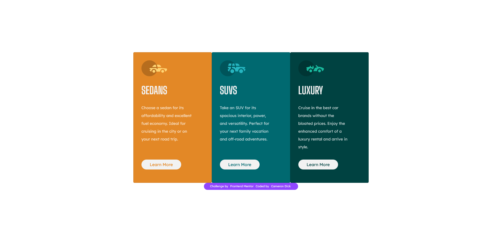

# Frontend Mentor - 3-column preview card component solution

This is my solution to the [3-column preview card component challenge on Frontend Mentor](https://www.frontendmentor.io/challenges/3column-preview-card-component-pH92eAR2-). Frontend Mentor challenges help you improve your coding skills by building realistic projects.

## Table of contents

- [Overview](#overview)
  - [The challenge](#the-challenge)
  - [Screenshot](#screenshot)
  - [Links](#links)
- [My process](#my-process)
  - [Built with](#built-with)
  - [What I learned](#what-i-learned)
  - [Continued development](#continued-development)
  - [Useful resources](#useful-resources)
- [Author](#author)

**Note: Delete this note and update the table of contents based on what sections you keep.**

## Overview

### The challenge

Users should be able to:

- View the optimal layout depending on their device's screen size
- See hover states for interactive elements

### Screenshot



### Links

- Solution URL: [Solution URL](https://your-solution-url.com)
- Live Site URL: [Live Site](https://ctdck.github.io/3-column-preview-card-component/)

## My process

### Built with

- Semantic HTML5 markup
- Bootstrap 5
- CSS custom properties

### What I learned

I was able to fix a width for each of the cards so that when the page scales the width stays the same. By styling the `col-md-4` class to have a fixed width and subsequently the `card` class a fixed height the cards stayed the same throughout page sizes.

I used the following structure to separate the card information from the other card elements, all contained inside one card class, see below:

```html
<div class="card ...">
  
  <div class="card-info">
    <h1>...</h1>
    <p>...</p>
  </div>
  <a href="#" class="btn">Learn More</a>
</div>
```

### Continued development

I would like to revisit this in future as the styling of each of the cards is not 100% accurate. For instance the middle card should not have any rounded edges and the outer cards should be styled more accurately.

I am still slightly unsure on how the grid structure works in bootstrap. Specifically, how to customise each entry more effectively. I do like the responsiveness of the layout and will continue to refine it in future projects.

Another aspect I need to improve upon is effective commenting and breaking up code to ease readability. Moreover the styles.css file I believe could be organised more efficiently.

### Useful resources

- [Bootstrap Docs](https://getbootstrap.com/docs/5.0/layout/grid/) - This source helps exemplify how to use and setup responsive containers.

## Author

- Website - [Cameron Dick](https://ctdck.github.io/CurriculumVitae/)
- Frontend Mentor - [@CTDck](https://www.frontendmentor.io/profile/CTDck)
- Twitter - [@dckenstein](https://www.twitter.com/dckenstein)
